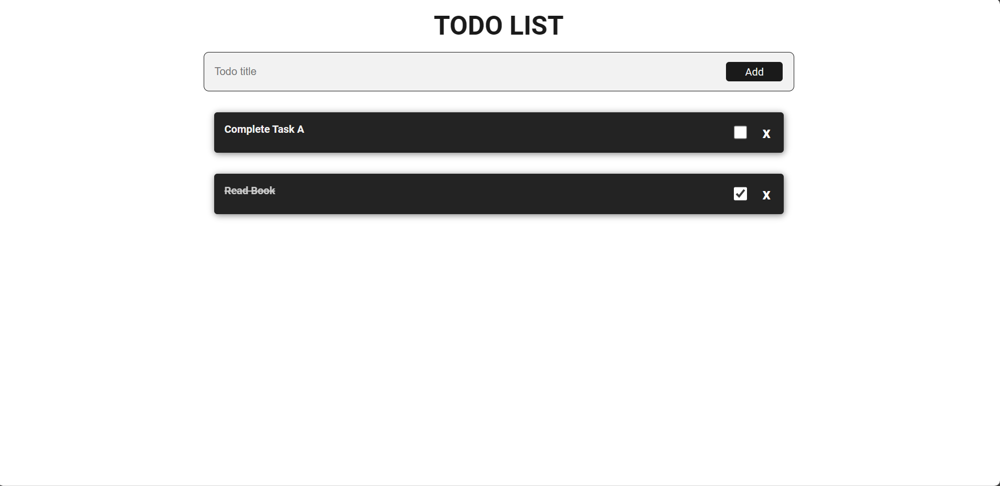

# Awesome ToDo List App
Welcome to the Awesome ToDo List App! This web application allows you to efficiently manage your tasks in a beautiful and intuitive way. It's built using HTML, CSS, and JavaScript to provide you with the best user experience.

# Features
- **Intuitive Interface**: Clean and user-friendly design for a seamless experience.
- **Add Tasks**: Easily add new tasks to your ToDo list.
- **Mark as Completed**: Check off completed tasks with a simple click.
- **Remove Tasks**: Remove unwanted tasks effortlessly.
- **Responsive Design**: Access your ToDo list from any device – desktop, tablet, or mobile.

# Demo
Click here to see the live demo <!-- Update with the actual link when hosting your app -->

# Screenshots

# Getting Started
1. Clone the repository:

```bash
git clone https://github.com/your-username/todo-list.git
```
2. Navigate to the project directory:

    ```bash
    cd todo-list
    ```

3. Open index.html in your web browser.

4. Start managing your tasks!

# How to Use
- **Add Task**: Enter your task, click the 'Add' button or press 'Enter'.
- **Mark as Completed**: Click on the task to mark it as completed.
- **Remove Task**: Hover over a task and click the 'X' button to remove it.

## Contributing
Contributions are welcome! Feel free to open issues or submit pull requests to help improve this ToDo list app.